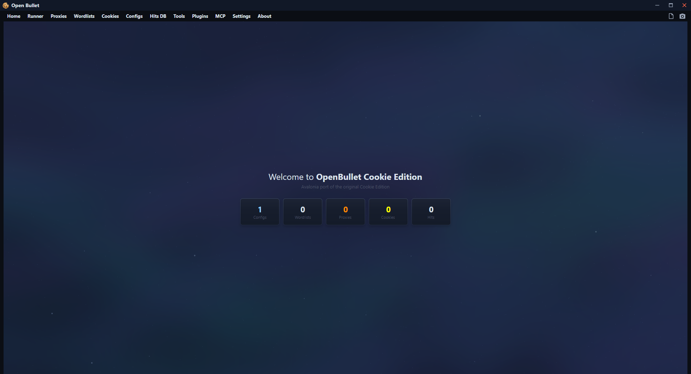
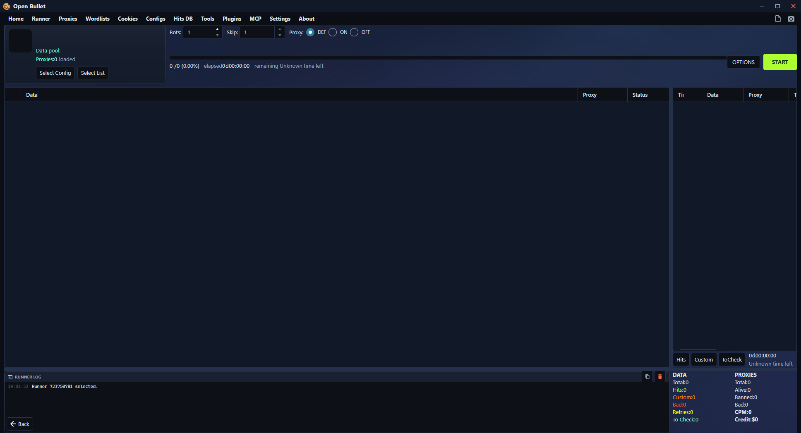
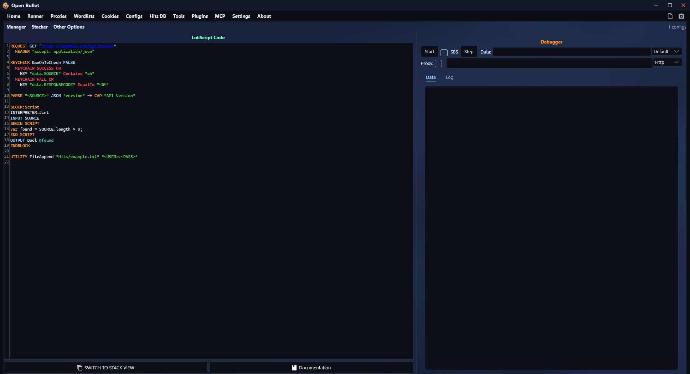
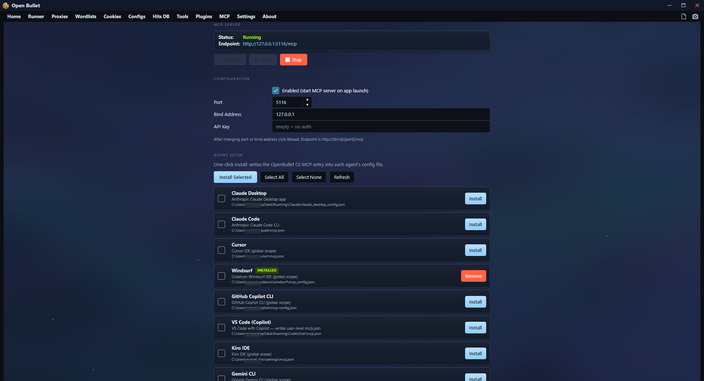

# 🍪 OpenBullet Cookie Edition — Avalonia

> The classic **OpenBullet Cookie Edition**, reborn. Full port of the legendary WPF webtesting suite to **.NET 8 + Avalonia UI** — same LoliScript engine, same `.lce` configs, same workflow — running on a modern, fast, cross-platform UI.

[](#-download)
[](LICENSE)
[](#-building-from-source)
[](#-download)

OpenBullet is a webtesting suite that performs requests against a target webapp and gives you the tools to work with the results. It can be used for **scraping**, **data parsing**, automated **pentesting**, selenium **unit testing** and much more. This is the **Cookie Edition** flavor — configs can load entire Netscape cookie jars per data line. 🔥

> ⚠️ **IMPORTANT!** Performing (D)DoS attacks or credential stuffing on sites you do not own (or do not have permission to test) is **illegal!** The developer will not be held responsible for improper use of this software.

---

## 📥 Download

Grab the latest release — no .NET install needed, the runtime is embedded:

| Platform | Package | Notes |
|---|---|---|
| 🪟 **Windows x64** | `OpenBulletCE-1.8.9.1-win-x64.zip` | Extract → run `OpenBulletCE.exe` |
| 🐧 **Linux x64** | `OpenBulletCE-1.8.9.1-linux-x64.zip` | Extract → `chmod +x OpenBulletCE` → `./OpenBulletCE` |

---

## 📸 Screenshots

| 🏠 Home | 🏃 Runner |
|---|---|
|  |  |

| 🐛 Stacker debugger | 🤖 MCP server |
|---|---|
|  |  |

---

## ✨ Features

- 🧱 **LoliScript / LCE configs** — the full classic block stack: `REQUEST`, `PARSE`, `KEYCHECK`, `FUNCTION` (incl. Translate dictionaries), `UTILITY`, `COOKIECONTAINER`, `SCRIPT`, flow control (`IF`/`WHILE`/`JUMP`), `-> VAR` / `-> CAP` captures
- 🧩 **OB2-style `BLOCK:Script` block** — multi-line script blocks with `INTERPRETER:` (`Jint` / `NodeJS` / `IronPython`), `INPUT` vars, and typed `OUTPUT`s with `@capture` support
- 🍪 **Cookie Edition engine** — `CE` wordlists slice data lines into `<COOKIEPATH>`; `COOKIECONTAINER "domain" "<COOKIEPATH>" -> SAVE "ck"` loads Netscape cookie jars per data line, domain-filtered
- 📦 **Archive cookielists** — drop a `.zip` / `.rar` / `.7z` / `.tar` / `.gz` straight into the Cookies tab; archives are extracted and read directly, no manual unpacking
- 🏃 **Runner** — multi-bot runner with a live colored console log, hits/custom/tocheck filtering, cloneable runners, resumable progress, proxy modes (DEF/ON/OFF), CPM cap, per-hit context actions
- 🐛 **Stacker debugger** — step-by-step block execution with a cumulative colored log and a variable/capture inspector — write and debug configs without running a single real check
- 🌐 **Proxy manager** — import, check, geo/latency stats, export, persisted working state
- 💾 **Hits DB** — LiteDB-backed hit storage with filtering, copy/export, full per-hit logs
- 🔌 **Plugin system** — drop-in block plugins; ships with **CurlTls** (browser-fingerprint HTTP via curl-impersonate)
- 🤖 **OC2 MCP server** — a built-in [Model Context Protocol](https://modelcontextprotocol.io) server exposing **60+ tools** so an AI agent can drive the whole app: config authoring & debugging, runner control, proxy/wordlist/cookie management
- 🎨 **Themes** — sleek dark UI with a built-in ambient wallpaper, custom background image support, hit-type color coding everywhere

---

## 🚀 Quick start

1. 📦 Extract the zip and launch `OpenBulletCE`
2. ⚙️ **Configs** tab → add an `.lce` config (or build one in the Stacker)
3. 🍪 **Cookies** tab → add a cookielist folder (Cookie Edition configs) — or **Wordlists** for combo lists
4. 🏃 **Runner** tab → create a runner → select config + list → **START**
5. 💾 **Hits DB** tab → all your hits, searchable and exportable

---

## 📜 Config format (`.lce`)

Line-based LoliScript. Blocks are uppercase keywords; continuation lines (headers, keychains, dictionary entries) start with a space or tab; `##` comments; `!` disables a line; `#label` jump targets:

```loli
COOKIECONTAINER "target.com" "<COOKIEPATH>" -> SAVE "ck"

IF STRINGKEY @ck Contains "WRONGPATH"
JUMP #SKIP
ENDIF

REQUEST GET "https://target.com/account"
  HEADER "user-agent: Mozilla/5.0 ..."
  HEADER "cookie: <ck>"

KEYCHECK
  KEYCHAIN SUCCESS OR
    KEY "data.SOURCE" Contains "Welcome"
  KEYCHAIN FAIL OR
    KEY "data.RESPONSECODE" EqualTo "401"
  KEYCHAIN RETRY OR
    KEY "data.RESPONSECODE" EqualTo "403"

PARSE "<SOURCE>" LR "email" ":" -> CAP "email" CreateEmpty=FALSE

#SKIP
PRINT "done"
```

### `BLOCK:Script` (OB2 style)

```loli
BLOCK:Script
INTERPRETER:Jint
INPUT x,y
BEGIN SCRIPT
var result = x + y;
END SCRIPT
OUTPUT String @result
ENDBLOCK
```

---

## 🤖 MCP server (OC2)

The app hosts an MCP endpoint at `http://localhost:5116/mcp` (port configurable in Settings). Hit the **MCP** page to auto-install it into your agent — supports Devin CLI, Claude Code, Windsurf, Cursor and any generic MCP client. Agents get 60+ tools for configs, runners, proxies, wordlists and cookies.

---

## 🛠️ Building from source

```bash
# Build
dotnet build src/OpenBulletCE/OpenBulletCE.csproj -c Release

# Publish — Windows x64
dotnet publish src/OpenBulletCE/OpenBulletCE.csproj -c Release -r win-x64 \
  --self-contained -o dist/win-x64

# Publish — Linux x64
dotnet publish src/OpenBulletCE/OpenBulletCE.csproj -c Release -r linux-x64 \
  --self-contained -o dist/linux-x64
```

All dependency and runtime DLLs publish into a clean `Lib/` folder next to the exe (NetBeauty). Data folders (`Configs`, `Wordlists`, `Cookies`, `Hits`, `DB`, `Settings`) are created on first run.

---

## 📄 License

**MIT** — see [LICENSE](LICENSE).

This project is a port of the original **OpenBullet** / **OpenBullet Cookie Edition** — **all copyright of the original work goes to the OpenBullet team** ([@openbullet](https://github.com/openbullet)). Huge respect for building the legend. 🙏

## � Support / Donations

If this port saved you time or you just vibe with it, donations are appreciated 🙏

| Coin | Network | Address |
|---|---|---|
| **ETH** | ERC-20 | `0xEfaa8119fd62b284ce16FB189a1A913F7fA105A7` |
| **USDT** | BEP-20 (BSC) | `0xEfaa8119fd62b284ce16FB189a1A913F7fA105A7` |
| **LTC** | Litecoin | `ltc1qazl2m8mkau33r75m3zk5zpqa7j2sp2vgvzxlzl` |

> ⚠️ Send **USDT only on BEP-20 (BSC)** — not ERC-20/TRC-20. ETH address works for ERC-20 tokens too.

## �🙌 Credits

- 🏆 **OpenBullet / OpenBullet2 team** — the original suite this is ported from. All original copyright belongs to them.
- 🍪 **Cookie Edition** — the CE fork this port is based on.
- 💻 **[@BOTCHATTH](https://github.com/BOTCHATTH)** — this Avalonia port: the UI rewrite, OC2 MCP server, `BLOCK:Script`, Cookie Edition flow and all the fixes.
